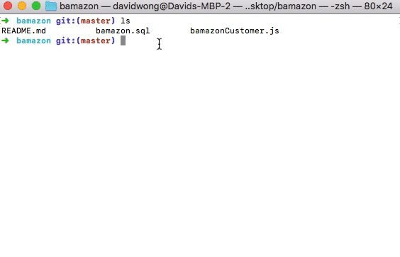

# bamazon

This application is created in the purpose of testing MySQL, node and npm. Similar to amazon, we have created bamazon, a store that shows stock items and enables the ability to purchase and restock supply. Bamazon is a command line application, where users can interact with the terminal. The terminal will be connected to an SQL database where all the stock items are listed and contained. 

### Installation

1. First you'll need the necessary application: Node and a command terminal. 
2. Clone the repository.
3. You will need download the necessary npm packages in the downloaded repository. 


## Packages
These are some of the packages needed to run the application.

1. MySQL

```npm install mysql```

2. cTable (A terminal npm that helps display data from the database in a clean formated way)

```npm install console.table```

3. Inquirer

```npm install inquirer```


## Demonstration 

**The gif shown below demonstrates the functionality of the application**

*Part 1*



*Part 2*
